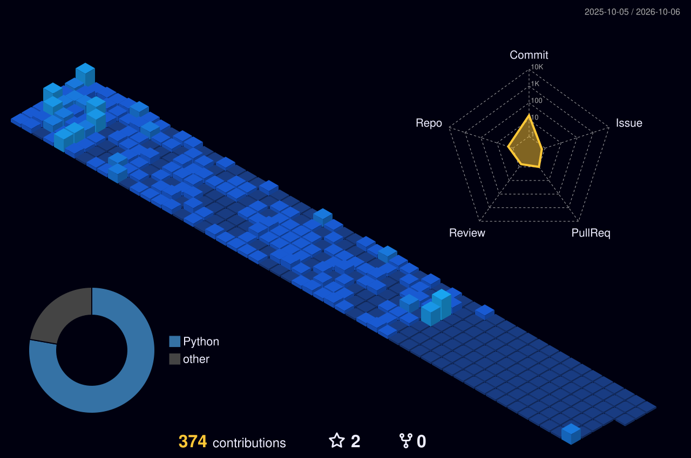
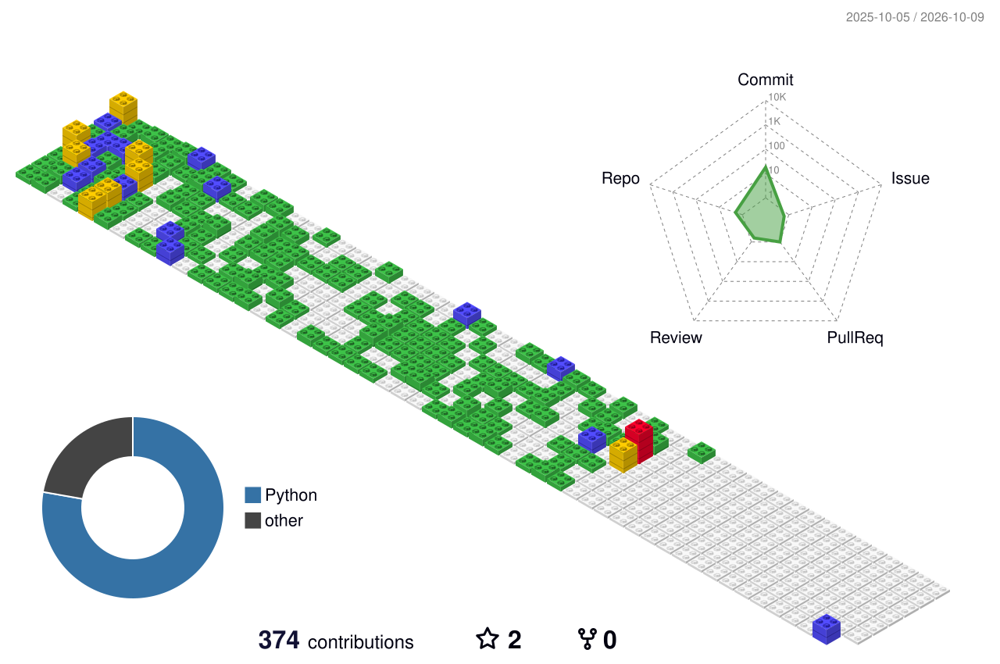

 

---

## 🚀 About Me

- 🌱 Currently learning **Advanced React, Node.js, Python**
- 🛡️ Interested in **Web & Mobile Security, SOC operations, Incident Response**
- 💻 Building modern and scalable web applications
- 📊 Exploring **Data Analysis with Python & R**
- 💬 Ask me about **JavaScript, React, Node.js, Python**
- 📫 Reach me at **[Mahdi09081@gmail.com](mailto:Mahdi09081@gmail.com)**
- ⚡ Fun fact: **Coffee + Code = Productivity ☕**

---

## 🧊 Contributions in 3D

<b>Night view</b>

 

  

<b>GitBlock style</b>

 

  

---

## 📊 GitHub Analytics

<table align="center">
<tr>
<td width="50%" align="center">

</td>
<td width="50%" align="center">

</td>
</tr>
<tr>
<td width="50%" align="center">

</td>
<td width="50%" align="center">

</td>
</tr>
</table>

  

---

## 🛠️ Tech Stack

  

---

## 🏆 GitHub Trophies

  

---

## 🐍 Contribution Snake

  <picture>
    <source media="(prefers-color-scheme: dark)" srcset="https://raw.githubusercontent.com/Mah09di/Mah09di/output/github-contribution-grid-snake-dark.svg" />
    <source media="(prefers-color-scheme: light)" srcset="https://raw.githubusercontent.com/Mah09di/Mah09di/output/github-contribution-grid-snake.svg" />
    
  </picture>

---

## 📫 Connect With Me

  
  
  
  

---

### 💡 Quote

*"First, solve the problem. Then, write the code."*

Often attributed to John Johnson

 

**⚡ Code with Passion • Build with Purpose • Never Stop Learning ⚡**

